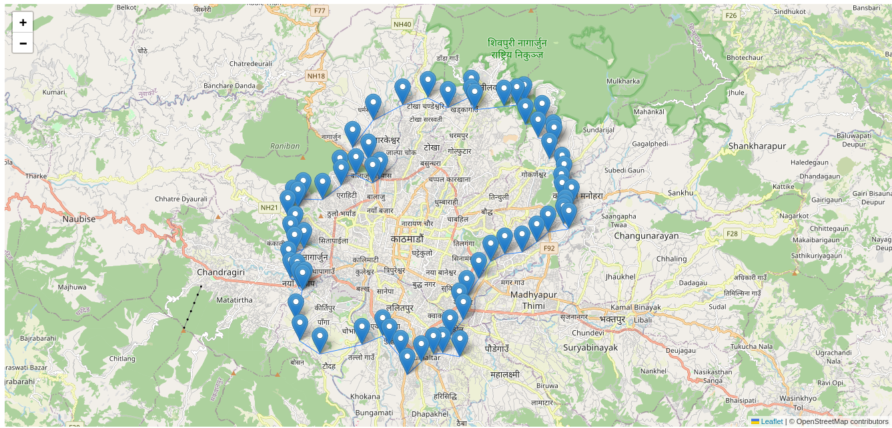
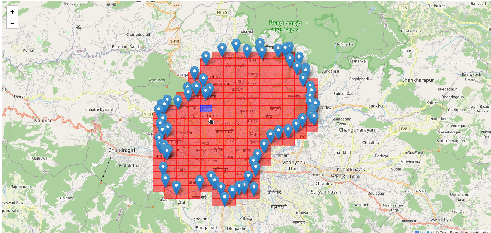

# geofence-to-geohash-grid
geofence to geohash grid   
**Perks**: Every grid has unique id and the id is same for the given location with precision mode.
# Screenshots

***Before***
 

***After***

